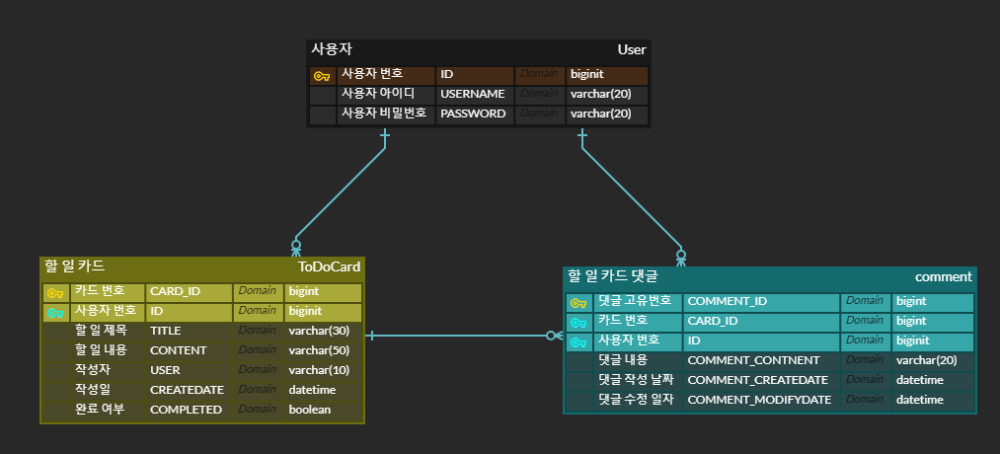

TodoList

# ERD

# 기능
## User
**회원가입 API**
- username, password를 Client에서 전달받기
- username은  `최소 4자 이상, 10자 이하이며 알파벳 소문자(a~z), 숫자(0~9)`로 구성되어야 한다.
- password는  `최소 8자 이상, 15자 이하이며 알파벳 대소문자(a~z, A~Z), 숫자(0~9)`로 구성되어야 한다.
- DB에 중복된 username이 없다면 회원을 저장하고 Client 로 성공했다는 메시지, 상태코드 반환하기

**로그인 API**
- username, password를 Client에서 전달받기
- DB에서 username을 사용하여 저장된 회원의 유무를 확인하고 있다면 password 비교하기
- 로그인 성공 시, 로그인에 성공한 유저의 정보와 JWT를 활용하여 토큰을 발급하고,
  발급한 토큰을 Header에 추가하고 성공했다는 메시지, 상태코드 와 함께 Client에 반환하기

## 할 일 카드 
**할 일 카드 작성 기능 API**
- 토큰을 검사하여, 유효한 토큰일 경우에만 할일 작성 가능
- `할일 제목`,`할일 내용`, `작성일`을 저장할 수 있습니다. (~~작성자명, 비밀번호)~~
- 할일 제목, 할일 내용을 저장하고, 저장된 할일을 Client 로 반환하기(username은 로그인 된 사용자)

**할 일 카드  조회 기능 API**
- 선택한 할일 의 정보를 조회할 수 있습니다.
  - 반환 받은 할일 정보에는 `할일 제목`,`할일 내용`, `작성자` , `작성일`정보가 들어있습니다.

**할 일 카드 목록 조회 기능 API**
- 등록된 할일 전체를 조회할 수 있습니다.
  - 회원별로 각각 나누어서 할일 목록이 조회됩니다.
  - 반환 받은 할일 정보에는 `할일 제목`, `작성자` , `작성일`, `완료 여부`정보가 들어있습니다.

**선택한 할일카드 수정 기능 API**
- 선택한 할 일 카드의 `제목`, `작성 내용`을 수정할 수 있습니다. (~~작성자명~~)
  - 토큰을 검사한 후, 유효한 토큰이면서 해당 사용자가 작성한 게시글만 수정 가능
  - 할 일 제목, 할 일 내용을 수정하고 수정된 할일 정보는 Client 로 반환됩니다.
- 수정된 할일의 정보를 반환 받아 확인할 수 있습니다.
    - 반환 받은 할일 정보에는 `할일 제목`,`할일 내용`, `작성자` , `작성일`정보가 들어있습니다.

**할일카드 완료 기능 API**
- 토큰을 검사한 후, 유효한 토큰이면서 해당 사용자가 작성한 할일카드 만 완료 가능
- 완료처리 한 할일카드는 목록조회시 `완료 여부`필드가 TRUE 로 내려갑니다.
- `완료 여부` 기본값은 FALSE